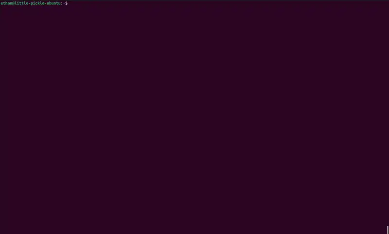

# Spelf

Spelf is a terminal-based search tool for people who can't spelf. Built with Rust, it provides a simple and intuitive interface for searching through a dictionary of words using fuzzy matching. Right now it uses default dictionary in `/usr/share/dict/words`. The application leverages the power of the `tui` crate for terminal UI and `strsim` for calculating Levenshtein distances.

---
## Demo


---

## Installation

1. Install Rust (if not already installed):
    Follow the instructions at [rust-lang.org](https://www.rust-lang.org/tools/install) to install Rust and Cargo.

2. Clone the repository:
    ```bash
    git clone https://github.com/elidonner/spelf.git
    cd spelf
    ```

3. Build and install Spelf:
    ```bash
    cargo install --path .
    ```

This will make `spelf` available globally, allowing you to run it from anywhere in your terminal.

---

## TODO

- Implement support for loading custom dictionaries.
- make it so people can download without building in rust?
